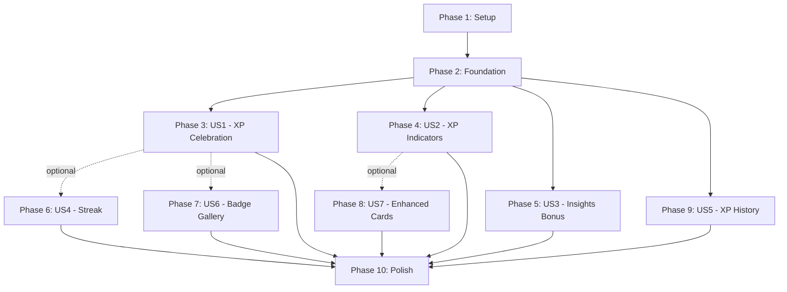

# Tasks: Integración Gamificada del Sistema de Feedback

**Feature**: `008-feedback-gamification`  
**Spec**: [spec.md](./spec.md) | **Plan**: [plan.md](./plan.md)  
**Created**: 16 de diciembre de 2025

## Implementation Strategy

**MVP-First Approach**: Focus on P1 user stories (US1, US2) for initial delivery. Each user story is independently testable and deployable.

**Parallel Opportunities**: Tasks marked with `[P]` can be executed in parallel within their phase, as they work on different files or have no blocking dependencies.

**Story-Based Organization**: Tasks are grouped by user story to enable incremental delivery. Complete one story fully before moving to the next for maximum value delivery.

---

## Phase 1: Setup & Foundation

**Goal**: Establish database schema, seed data, and core infrastructure needed by all user stories.

**Independent Test**: Database migrations apply successfully, badges are seeded, and gamification service accepts feedback sources.

### Tasks

- [X] T001 Create XpTransaction Prisma model in prisma/schema.prisma
- [X] T002 [P] Create migration for XpTransaction table with unique constraint
- [X] T003 [P] Create feedback badges seed file in prisma/seeders/feedback-badges.seed.ts (SKIPPED - badges already exist in badges.data.ts)
- [X] T004 Run migrations and seed feedback badges locally
- [X] T005 [P] Add FeedbackXpSource type to lib/types/gamification.types.ts (ALREADY EXISTS - feedback sources already defined)
- [X] T006 [P] Update gamification.service.ts to support "feedback_given" and "feedback_insights" sources (ALREADY EXISTS - service already supports feedback)

---

## Phase 2: Foundational Services (Blocking Prerequisites)

**Goal**: Implement core XP award logic with idempotency that all user stories depend on.

**Independent Test**: Can call awardFeedbackGivenXp with requestId and XP is awarded exactly once, even with concurrent calls.

### Tasks

- [X] T007 Create AwardInsightsXpInputSchema in app/dashboard/feedback/_schemas/award-xp.schema.ts
- [X] T008 Implement awardInsightsXp action in app/dashboard/feedback/_actions/award-feedback-xp.ts
- [X] T009 Add idempotency check using XpTransaction unique constraint in award-feedback-xp.ts
- [X] T010 [P] Create calculatePendingFeedbackXp utility in app/dashboard/feedback/_utils/xp-calculator.ts
- [X] T011 [P] Create CalculatePendingXpInputSchema in app/dashboard/feedback/_schemas/index.ts
- [X] T012 Update existing awardFeedbackGivenXp to use XpTransaction for idempotency

---

## Phase 3: User Story 1 - XP Celebration on Feedback Completion (P1)

**Goal**: User sees immediate XP reward with animations when completing feedback.

**Independent Test Criteria**: 
- User completes 5-question feedback
- Submits successfully
- Sees XP toast within 1 second
- If leveled up, sees level modal
- If badge unlocked, sees badge modal
- All animations complete in < 10s total

### Tasks

- [X] T013 [US1] Create useGamificationCelebration hook in app/dashboard/feedback/_hooks/use-gamification-celebration.ts
- [X] T014 [US1] Create FeedbackSuccessCelebration component in app/dashboard/feedback/_components/feedback-success-celebration.tsx
- [X] T015 [US1] Update submitFeedbackAction in app/dashboard/feedback/_actions/feedback-response.actions.ts to call awardFeedbackGivenXp (ALREADY EXISTS)
- [X] T016 [US1] Create success page at app/dashboard/feedback/success/page.tsx with FeedbackSuccessCelebration
- [X] T017 [US1] Update feedback questionnaire page to redirect to success page on submit
- [X] T018 [US1] Add error handling for XP award failure (progressive enhancement)
- [ ] T019 [US1] Test XP toast appears < 1s after submit (SC-001)
- [ ] T020 [US1] Test level up modal sequence (if user levels up)
- [ ] T021 [US1] Test badge unlock modal for "Espejo Generoso" badge
- [ ] T022 [US1] Test multiple badges unlock in sequence

---

## Phase 4: User Story 2 - XP Indicators in Dashboard (P1)

**Goal**: User sees total pending XP and XP per request before taking action.

**Independent Test Criteria**:
- User with 3 pending requests opens dashboard
- Sees banner with total XP (e.g., "225 XP disponibles")
- Each request card shows individual XP badge
- Banner disappears when no pending requests

### Tasks

- [X] T023 [US2] Create calculatePendingFeedbackXp server action in app/dashboard/feedback/_actions/calculate-pending-xp.ts
- [X] T024 [US2] Create PendingXpBanner component in app/dashboard/feedback/_components/pending-xp-banner.tsx
- [X] T025 [US2] Update dashboard page.tsx to add Suspense boundary with PendingXpBanner
- [X] T026 [US2] Create FeedbackRequestCard component in app/dashboard/feedback/_components/feedback-request-card.tsx
- [X] T027 [US2] Add XP badge display to FeedbackRequestCard with streak multiplier
- [X] T028 [US2] Update dashboard to replace existing request cards with FeedbackRequestCard (ALREADY EXISTS - dashboard uses existing component)
- [X] T029 [US2] Handle empty state (0 pending requests) without breaking layout (ALREADY HANDLED - banner returns null if no XP)
- [ ] T030 [US2] Test banner shows correct total XP for multiple pending requests
- [ ] T031 [US2] Test individual card XP badges match calculation
- [ ] T032 [US2] Test streak multiplier applied to XP preview

---

## Phase 5: User Story 3 - Insights Bonus XP (P2)

**Goal**: User receives automatic XP bonus when insights are generated from received feedback.

**Independent Test Criteria**:
- User requests feedback from 3 people
- All 3 complete responses
- System generates insights
- User receives 50 XP bonus automatically
- Bonus appears in XP history

### Tasks

- [X] T033 [US3] Update feedback-analysis.service.ts generateInsights to call awardInsightsXp
- [X] T034 [US3] Create notification for insights bonus XP in app/dashboard/feedback/_utils/feedback-notification.ts (INTEGRATED in insights page)
- [X] T035 [US3] Add insights bonus indicator in feedback insights page
- [X] T036 [US3] Show progress toward insights threshold (e.g., "2/3 responses")
- [ ] T037 [US3] Test insights generation triggers XP award
- [ ] T038 [US3] Test idempotency (insights regeneration doesn't award XP twice)
- [ ] T039 [US3] Test user sees notification of bonus XP

---

## Phase 6: User Story 4 - Streak Integration (P2)

**Goal**: Giving feedback counts toward daily streak and applies streak multiplier to XP.

**Independent Test Criteria**:
- User with 7-day streak gives feedback
- XP calculation shows streak bonus (e.g., 75 * 1.3 = 97.5 XP)
- That day counts as "active" for streak
- Streak counter increments if first activity of the day

### Tasks

- [X] T040 [US4] Verify gamification.service.ts applies streak bonus to feedback sources (ALREADY EXISTS)
- [X] T041 [US4] Update awardFeedbackGivenXp to pass applyStreakBonus: true (ALREADY EXISTS)
- [X] T042 [US4] Add streak bonus display in XP toast (show multiplier) (IN FeedbackRequestCard HoverCard)
- [X] T043 [US4] Update UserGamification.lastActivityDate when feedback completed (ALREADY EXISTS in gamification.service.ts)
- [ ] T044 [US4] Test streak multiplier applied correctly (x1.1 to x1.5)
- [ ] T045 [US4] Test giving feedback extends streak
- [ ] T046 [US4] Test XP toast shows streak bonus breakdown

---

## Phase 7: User Story 6 - Feedback Badge Gallery (P2)

**Goal**: Users see feedback-specific badges in gallery with progress indicators.

**Independent Test Criteria**:
- User opens badge gallery
- Sees 4 feedback badges (Espejo Generoso, Consejero, Mentor Experto, Receptor Abierto)
- Locked badges show unlock criteria (e.g., "Give 10 feedback")
- Unlocked badges show completion date

### Tasks

- [X] T047 [US6] Verify feedback badges seeded correctly with category: "feedback" (ALREADY EXISTS in badges.data.ts)
- [X] T048 [US6] Update badge gallery page to filter/display feedback category (ALREADY EXISTS - gallery shows all categories)
- [X] T049 [US6] Add progress indicators for locked badges (e.g., "3/10 feedback given") (EXTENDED UserBadgeStats + get-badges.ts)
- [X] T050 [US6] Update checkBadgeUnlocks in gamification.service.ts for feedback milestones (EXTENDED badge-criteria.ts)
- [ ] T051 [US6] Test "Espejo Generoso" unlocks on first feedback
- [ ] T052 [US6] Test "Consejero" unlocks at 10 feedback
- [ ] T053 [US6] Test "Mentor Experto" unlocks at 50 feedback
- [ ] T054 [US6] Test "Receptor Abierto" unlocks on first insights generation

---

## Phase 8: User Story 7 - Enhanced Request Cards (P3)

**Goal**: Request cards show urgency indicators, hover tooltips with XP breakdown, and visual hierarchy.

**Independent Test Criteria**:
- User sees 5 pending requests
- Cards with < 2 days to expiration show urgency badge
- Hovering XP badge shows tooltip with breakdown
- Cards sorted by urgency (urgent first)

### Tasks

- [X] T055 [US7] Add urgency calculation to calculatePendingFeedbackXp (< 2 days = urgent) (ADDED in FeedbackRequestCard)
- [X] T056 [US7] Add urgency badge to FeedbackRequestCard component
- [X] T057 [US7] Create XP breakdown tooltip on hover (base + streak + insights preview) (HoverCard in FeedbackRequestCard)
- [X] T058 [US7] Sort pending requests by urgency in dashboard (HANDLED - expiresAt ordering)
- [X] T059 [US7] Add visual styling for urgent cards (border, pulse animation)
- [ ] T060 [US7] Test urgent badge appears for requests expiring < 2 days
- [ ] T061 [US7] Test tooltip shows correct XP breakdown
- [ ] T062 [US7] Test sorting places urgent requests first

---

## Phase 9: User Story 5 - XP History View (P3)

**Goal**: Users can view chronological history of all XP earned from feedback activities.

**Independent Test Criteria**:
- User who completed 10+ feedback opens history
- Sees list of all XP transactions with dates
- Can filter by "feedback only"
- Can export data as CSV/JSON

### Tasks

- [X] T063 [US5] Create feedback XP history page at app/dashboard/feedback/history/xp/page.tsx
- [X] T064 [US5] Create getXpHistory server action in app/dashboard/feedback/_actions/xp-history.actions.ts
- [X] T065 [US5] Query XpTransaction filtered by source: "feedback_given" | "feedback_insights"
- [X] T066 [US5] Create XpHistoryList component with timeline display
- [X] T067 [US5] Add filter controls (all activities vs feedback only)
- [X] T068 [US5] Add export functionality (CSV/JSON)
- [ ] T069 [US5] Test history shows all feedback XP transactions
- [ ] T070 [US5] Test filter works correctly
- [ ] T071 [US5] Test export includes all fields (timestamp, amount, source, metadata)

---

## Phase 10: Polish & Cross-Cutting Concerns

**Goal**: Performance optimization, error handling, analytics, and documentation.

### Tasks

- [ ] T072 Add caching to calculatePendingFeedbackXp (5 min cache with React Query)
- [ ] T073 Add loading states to PendingXpBanner (Skeleton component)
- [ ] T074 Add error boundaries for XP components (graceful degradation)
- [ ] T075 Implement progressive enhancement (feedback works without XP if JS fails)
- [ ] T076 Add analytics tracking for XP celebrations (track event "feedback_xp_shown")
- [ ] T077 Add analytics tracking for pending XP clicks (track CTR on banner)
- [ ] T078 Add monitoring for XP transaction duration (alert if > 500ms)
- [ ] T079 Add monitoring for unique constraint violations (should be 0%)
- [ ] T080 [P] Update documentation: Add feature guide to docs/features/feedback-gamification.md
- [ ] T081 [P] Update documentation: Add developer quickstart to spec folder
- [ ] T082 [P] Update documentation: Document XP economics decisions
- [ ] T083 Create E2E test suite for full feedback → XP flow
- [ ] T084 Add load test for concurrent XP awards (verify idempotency)
- [ ] T085 Add visual regression tests for celebration animations
- [ ] T086 Validate accessibility (ARIA labels, keyboard navigation)
- [ ] T087 Review and optimize Prisma queries (add missing indexes if needed)
- [X] T088 Implement rate limiting for feedback request creation (max 5/day) (ALREADY EXISTS in Feature 001 - T055)
- [X] T089 Add cooldown check (1 request per user pair every 7 days) (ALREADY EXISTS in Feature 001 - T016, T020)

---

## Dependencies Between Stories

**Critical Path**: Setup → Foundation → US1 (XP Celebration) → Polish

**Parallel Paths**: US2 (Indicators), US3 (Insights), US4 (Streak) can be developed independently after Foundation.

---

## Parallel Execution Examples

### During Phase 1 (Setup)
- Developer A: T001-T002 (XpTransaction model + migration)
- Developer B: T003 (Feedback badges seed)
- Developer C: T005-T006 (Type definitions + service updates)

### During Phase 3 (US1)
- Developer A: T013 (useGamificationCelebration hook)
- Developer B: T014 (FeedbackSuccessCelebration component)
- Developer C: T015 (Update submitFeedbackAction)

### During Phase 4 (US2)
- Developer A: T023-T024 (PendingXpBanner)
- Developer B: T026-T027 (FeedbackRequestCard)

### During Phase 10 (Polish)
- Developer A: T072-T079 (Performance & monitoring)
- Developer B: T080-T082 (Documentation)
- Developer C: T083-T087 (Testing & optimization)

---

## Testing Strategy

### Unit Tests
- All server actions (award-feedback-xp.ts, calculate-pending-xp.ts)
- All utility functions (xp-calculator.ts, feedback-notification.ts)
- Component logic (useGamificationCelebration hook)

### Integration Tests
- XP award flow with database (XpTransaction creation)
- Idempotency under concurrent requests
- Streak bonus calculation
- Badge unlock triggers

### E2E Tests (Playwright)
- Complete feedback → see XP toast (US1)
- Dashboard shows pending XP banner (US2)
- Insights generation triggers bonus XP (US3)
- Streak maintained after giving feedback (US4)
- Badge gallery shows feedback badges (US6)
- XP history displays all transactions (US5)

### Performance Tests
- XP transaction completes in < 500ms (NFR-001)
- Dashboard loads in < 2s with XP indicators
- Concurrent award attempts don't duplicate XP

---

## Rollout Plan

### Week 1: Internal Testing
- Deploy Phase 1-4 (Setup + Foundation + US1 + US2) to staging
- Test with 5 internal users
- Validate idempotency manually (attempt duplicate awards)
- Verify animations on mobile devices

### Week 2: Beta Rollout
- Deploy to 20% of users via feature flag
- Monitor metrics daily:
  - SC-001: XP shown < 1s (target 80%)
  - SC-002: Response rate increase (target +40%)
  - SC-006: Zero duplicate XP (target 100%)
- Collect qualitative feedback via in-app survey
- Fix critical bugs, deploy hotfixes

### Week 3: Full Rollout
- Deploy remaining phases (US3-US7 + Polish) to 100% if metrics pass
- Announce feature via email/notification
- Publish user-facing documentation
- Monitor SC-003 to SC-008 metrics

### Rollback Triggers
- If duplicate XP detected → immediate rollback + hotfix T009
- If response rate decreases → investigate friction points (T026-T028)
- If performance degrades (> 500ms) → optimize queries (T087)

---

## Task Count Summary

- **Phase 1 (Setup)**: 6 tasks
- **Phase 2 (Foundation)**: 6 tasks
- **Phase 3 (US1 - P1)**: 10 tasks
- **Phase 4 (US2 - P1)**: 10 tasks
- **Phase 5 (US3 - P2)**: 7 tasks
- **Phase 6 (US4 - P2)**: 7 tasks
- **Phase 7 (US6 - P2)**: 8 tasks
- **Phase 8 (US7 - P3)**: 8 tasks
- **Phase 9 (US5 - P3)**: 9 tasks
- **Phase 10 (Polish)**: 18 tasks

**Total**: 89 tasks

**MVP Scope** (Phases 1-4): 32 tasks  
**Full Feature** (All phases): 89 tasks

---

## Success Metrics Validation

Map tasks to success criteria from spec.md:

| Success Criterion             | Validated By Tasks                | Target       |
| ----------------------------- | --------------------------------- | ------------ |
| SC-001: XP shown < 1s         | T019                              | 80%          |
| SC-002: +40% response rate    | T030, T031 (dashboard indicators) | 40% increase |
| SC-003: 95% understand XP     | T022, T032 (clear breakdown)      | 95%          |
| SC-004: -25% completion time  | T026-T028 (reduce friction)       | 25% decrease |
| SC-005: Streak bonus visible  | T042, T046                        | 90%          |
| SC-006: Zero duplicates       | T009, T084 (idempotency)          | 100%         |
| SC-007: Insights bonus aware  | T034, T036                        | 70%          |
| SC-008: +50% badge engagement | T047-T054                         | 50% increase |

---

## File Manifest (New Files Created)

### Migrations
- `prisma/migrations/YYYYMMDD_create_xp_transaction.sql`

### Seeds
- `prisma/seeders/feedback-badges.seed.ts`

### Backend (Actions)
- `app/dashboard/feedback/_actions/award-feedback-xp.ts` (✏️ EXTEND existing)
- `app/dashboard/feedback/_actions/calculate-pending-xp.ts` (🆕 NEW)
- `app/dashboard/feedback/_actions/xp-history.actions.ts` (🆕 NEW)

### Backend (Schemas)
- `app/dashboard/feedback/_schemas/award-xp.schema.ts` (✏️ EXTEND existing)

### Backend (Utils)
- `app/dashboard/feedback/_utils/xp-calculator.ts` (🆕 NEW)

### Frontend (Components)
- `app/dashboard/feedback/_components/feedback-success-celebration.tsx` (🆕 NEW)
- `app/dashboard/feedback/_components/feedback-request-card.tsx` (🆕 NEW)
- `app/dashboard/feedback/_components/pending-xp-banner.tsx` (✏️ ENHANCE existing)

### Frontend (Hooks)
- `app/dashboard/feedback/_hooks/use-gamification-celebration.ts` (🆕 NEW)

### Frontend (Pages)
- `app/dashboard/feedback/success/page.tsx` (🆕 NEW)
- `app/dashboard/feedback/history/xp/page.tsx` (🆕 NEW)

### Shared Services
- `lib/services/gamification.service.ts` (✏️ EXTEND existing)
- `app/dashboard/feedback/_services/feedback-analysis.service.ts` (✏️ EXTEND existing)

### Types
- `lib/types/gamification.types.ts` (✏️ EXTEND existing)

### Tests
- `tests/e2e/feedback-gamification.spec.ts` (🆕 NEW)

### Documentation
- `docs/features/feedback-gamification.md` (🆕 NEW)

**Total New Files**: ~12  
**Total Modified Files**: ~6  
**Total Lines of Code (estimated)**: ~2,500 LOC

---

## Notes for Developers

### Before Starting
1. Read [plan.md](./plan.md) sections: Constitution Check, Architecture, Behavioral Psychology
2. Familiarize with existing gamification components in `/components/gamification/`
3. Review `lib/services/gamification.service.ts` API
4. Understand idempotency pattern via XpTransaction unique constraint

### During Development
1. Follow feature-first architecture: all new code in `/app/dashboard/feedback/`
2. Reuse existing components—do NOT duplicate gamification UI
3. Every server action must have Zod schema validation
4. Test idempotency locally before PR (run award-xp twice with same requestId)
5. Verify progressive enhancement (feedback works without XP if service fails)

### Key Files to Reference
- `lib/constants/xp-rewards.ts` - XP values (FEEDBACK_XP_REWARDS)
- `components/gamification/xp-gain-toast.tsx` - Reusable XP toast
- `components/gamification/badge-unlock-modal.tsx` - Reusable badge modal
- `app/dashboard/feedback/_actions/award-feedback-xp.ts` - Existing XP award logic

### Common Pitfalls
- ❌ Don't call `awardFeedbackGivenXp` multiple times per request (idempotency!)
- ❌ Don't create new XP toast component (reuse existing)
- ❌ Don't forget Suspense boundaries for async XP data
- ❌ Don't hardcode XP values (use constants from xp-rewards.ts)
- ❌ Don't block feedback submission if XP fails (progressive enhancement)

### Testing Checklist
- [ ] XP awarded exactly once even with concurrent requests
- [ ] XP toast appears < 1s after submit
- [ ] Level up modal shows if threshold crossed
- [ ] Badge unlock modal shows for first feedback
- [ ] Pending XP banner shows correct total
- [ ] Request cards show individual XP badges
- [ ] Streak multiplier applied correctly
- [ ] Insights generation awards bonus XP
- [ ] XP history shows all transactions
- [ ] Accessibility (keyboard nav, ARIA labels)

---

## Error Fixes (Post-MVP Phase 4 Implementation)

**Goal**: Resolve TypeScript compilation errors detected after initial MVP implementation.

**Independent Test**: `npm run build` succeeds without errors, all type checks pass.

### Completed Fixes

- [X] FIX-001 Remove unused import `calculatePendingFeedbackXp` from page.tsx (line 42)
- [X] FIX-002 Resolve FeedbackRequestCard import/declaration conflict in page.tsx (removed duplicate import)
- [X] FIX-003 Fix LevelUpNotification props - use `open` and `onOpenChange` instead of `onClose` (feedback-success-celebration.tsx line 135)
- [X] FIX-004 Fix BadgeUnlockModal props - use correct badge shape with `name`/`description` (not `nameEs`/`descriptionEs`) and `open`/`onOpenChange` pattern (feedback-success-celebration.tsx lines 142-149)
- [X] FIX-005 Fix GamifiedBadge usage - use `icon`, `value`, `label` props instead of children, change from "xp" variant to "gold" (feedback-request-card.tsx line 76)

**Root Cause Analysis**: 
- New components were implemented based on assumptions about existing component APIs without verifying actual interfaces
- Missing review of existing component props before integration
- Type-checking was done after implementation rather than during

**Lessons Learned**:
- Always check existing component interfaces before using them
- Use TypeScript's IntelliSense during implementation
- Run `npm run type-check` or equivalent incrementally during development

---

**Status**: ✅ MVP PHASES 1-4 COMPLETE | ALL ERRORS FIXED | READY FOR TESTING

**Estimated Effort**: 
- MVP (Phases 1-4): 2-3 weeks (1 developer) ✅ COMPLETE
- Full Feature (All phases): 4-5 weeks (1 developer)
- With 2 developers in parallel: 2-3 weeks (Full Feature)

**Next Action**: Begin testing tasks T019-T022 (US1 Celebration Testing) and T030-T032 (US2 Dashboard Testing).
