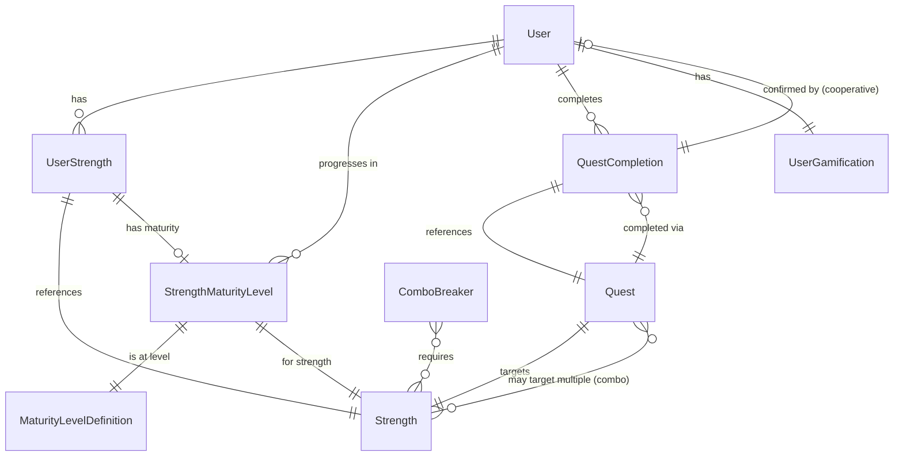

# Data Model: Sistema de Niveles de Madurez para Fortalezas

**Feature**: strength-levels | **Date**: 21 de diciembre de 2025

## Overview

Este documento define el modelo de datos para el sistema de niveles de madurez de fortalezas. Extiende los modelos existentes `UserStrength`, `UserGamification` y `XpTransaction` sin modificarlos, añadiendo nuevas entidades para misiones, niveles de madurez, combos y completitud de misiones.

## Entity Relationship Diagram



## Entities

### StrengthMaturityLevel
Representa el nivel de madurez actual de una fortaleza específica para un usuario.

**Attributes:**
- `id`: String (UUID, PK)
- `userId`: String (FK → User.id, required, cascadeDelete)
- `strengthId`: String (FK → Strength.id, required, cascadeDelete)
- `maturityLevel`: Enum (`SPONGE`, `CONNECTOR`, `GUIDE`, `ALCHEMIST`) - Nivel actual
- `xpCurrent`: Int (default: 0) - XP acumulado en el nivel actual
- `xpTotal`: Int (default: 0) - XP total histórico de esta fortaleza
- `levelReachedAt`: DateTime? - Fecha cuando se alcanzó el nivel actual
- `createdAt`: DateTime (default: now())
- `updatedAt`: DateTime (auto-updated)

**Indexes:**
- Unique: `[userId, strengthId]` - Una entrada por usuario-fortaleza
- Index: `[userId]` - Queries rápidas por usuario
- Index: `[maturityLevel]` - Analytics por distribución de niveles

**Relationships:**
- Belongs to: `User` (userId)
- Belongs to: `Strength` (strengthId)
- References: `MaturityLevelDefinition` (implicit via maturityLevel enum)

**Business Rules:**
- Al crear una `UserStrength`, se crea automáticamente un `StrengthMaturityLevel` con nivel `SPONGE` y xpCurrent=0
- `xpTotal` siempre >= `xpCurrent`
- Al subir de nivel, `xpCurrent` se reinicia a 0, `xpTotal` se mantiene acumulativo

---

### Quest
Representa una misión asignable a un usuario. Puede ser generada desde plantilla o ser una instancia activa.

**Attributes:**
- `id`: String (UUID, PK)
- `userId`: String? (FK → User.id, nullable, cascadeDelete) - Null si es plantilla global
- `type`: Enum (`DAILY`, `BOSS_BATTLE`, `COMBO_BREAKER`, `COOPERATIVE`) - Tipo de misión
- `strengthId`: String (FK → Strength.id, required) - Fortaleza principal objetivo
- `comboBreakerId`: String? (FK → ComboBreaker.id, nullable) - Solo para tipo COMBO_BREAKER
- `title`: String - Título corto de la misión
- `description`: String - Descripción accionable de la tarea
- `xpReward`: Int - XP base a otorgar (50 diaria, 150 boss, 100 combo, 75 coop)
- `status`: Enum (`AVAILABLE`, `IN_PROGRESS`, `COMPLETED`, `EXPIRED`) - Estado actual
- `expiresAt`: DateTime? - Fecha de expiración (24h para diarias, null para boss en cooldown)
- `cooldownUntil`: DateTime? - Fecha hasta la cual no puede regenerarse (7d boss, 72h combo, 48h coop)
- `isTemplate`: Boolean (default: false) - True si es plantilla en catálogo, false si es instancia activa
- `createdAt`: DateTime (default: now())
- `updatedAt`: DateTime (auto-updated)

**Indexes:**
- Index: `[userId, status, expiresAt]` - Query eficiente de misiones activas
- Index: `[type, isTemplate]` - Query de plantillas por tipo
- Index: `[strengthId]` - Misiones por fortaleza

**Relationships:**
- Belongs to: `User` (userId, nullable)
- Belongs to: `Strength` (strengthId)
- Belongs to: `ComboBreaker` (comboBreakerId, nullable)
- Has many: `QuestCompletion`

**Business Rules:**
- Si `isTemplate=true`, entonces `userId=null`, `status=AVAILABLE`, `expiresAt=null`
- Si `type=DAILY`, entonces `expiresAt` debe ser now() + 24h
- Si `type=BOSS_BATTLE` y está en cooldown, `status=AVAILABLE` pero `cooldownUntil > now()`
- Solo una misión diaria activa por usuario-fortaleza simultáneamente

---

### QuestCompletion
Registro de auditoría de misiones completadas. Garantiza idempotencia y trazabilidad.

**Attributes:**
- `id`: String (UUID, PK)
- `questId`: String (FK → Quest.id, required, restrict delete)
- `userId`: String (FK → User.id, required, cascadeDelete)
- `xpAwarded`: Int - XP realmente otorgado (puede incluir bonuses)
- `completedAt`: DateTime (default: now())
- `confirmedBy`: String? (FK → User.id, nullable) - Para misiones cooperativas, quién confirmó
- `confirmedAt`: DateTime? - Cuando se confirmó (cooperativas)
- `reflectionNote`: String? - Opcional: respuesta a pregunta reflexiva
- `metadata`: String? (JSON) - Información adicional (ej: `{"streakBonus": 1.1, "comboStrengths": ["str1", "str2"]}`)

**Indexes:**
- Unique: `[userId, questId]` - Idempotencia: cada misión solo se completa una vez por usuario
- Index: `[userId, completedAt]` - Historial ordenado por fecha
- Index: `[questId]` - Completaciones por misión

**Relationships:**
- Belongs to: `Quest` (questId)
- Belongs to: `User` (userId)
- Belongs to: `User` (confirmedBy, nullable)

**Business Rules:**
- Al crear un `QuestCompletion`, se debe:
  1. Crear un `XpTransaction` con `source="quest_completed"`, `sourceId=questId`, `amount=xpAwarded`
  2. Actualizar `StrengthMaturityLevel.xpCurrent` y `xpTotal`
  3. Verificar si alcanzó próximo nivel (xpCurrent >= threshold)
  4. Si sube de nivel: resetear `xpCurrent=0`, incrementar `maturityLevel`, set `levelReachedAt=now()`
  5. Actualizar `Quest.status` a `COMPLETED`
- Para misiones cooperativas: `xpAwarded` se otorga cuando `confirmedBy != null` AND `confirmedAt < expiresAt + 48h`

---

### ComboBreaker
Define sinergias entre 2+ fortalezas. Catálogo predefinido (seed data).

**Attributes:**
- `id`: String (UUID, PK)
- `name`: String - Nombre épico del combo (ej: "Visión Ejecutora")
- `nameEs`: String - Nombre en español
- `description`: String - Descripción de la misión combo
- `descriptionEs`: String - Descripción en español
- `xpReward`: Int (default: 100) - XP base por fortaleza participante
- `cooldownHours`: Int (default: 72) - Horas de cooldown después de completar
- `minMaturityLevel`: Enum (`SPONGE`, `CONNECTOR`, `GUIDE`, `ALCHEMIST`) - Nivel mínimo requerido
- `requiredStrengthCount`: Int (default: 2) - Número de fortalezas requeridas (2 o 3)
- `isActive`: Boolean (default: true) - Si está habilitado
- `createdAt`: DateTime (default: now())
- `updatedAt`: DateTime (auto-updated)

**Indexes:**
- Unique: `[name]` - Nombres únicos de combos
- Index: `[isActive]` - Query de combos activos

**Relationships:**
- Has many through: `ComboStrength` → `Strength` (many-to-many)

**Business Rules:**
- Un combo se desbloquea para un usuario si tiene TODAS las fortalezas requeridas en `minMaturityLevel` o superior
- Al completar un combo, se crea un `Quest` de tipo `COMBO_BREAKER` con `cooldownUntil = now() + cooldownHours`
- El `xpReward` se otorga a CADA fortaleza participante (ej: combo de 2 fortalezas = 200 XP total, 100 por cada una)

---

### ComboStrength (Junction Table)
Relaciona combos con las fortalezas requeridas.

**Attributes:**
- `id`: String (UUID, PK)
- `comboBreakerId`: String (FK → ComboBreaker.id, required, cascadeDelete)
- `strengthId`: String (FK → Strength.id, required, cascadeDelete)
- `order`: Int (default: 0) - Orden de prioridad en la descripción

**Indexes:**
- Unique: `[comboBreakerId, strengthId]` - Una fortaleza por combo max 1 vez
- Index: `[comboBreakerId]` - Query de fortalezas por combo
- Index: `[strengthId]` - Query de combos por fortaleza

**Relationships:**
- Belongs to: `ComboBreaker` (comboBreakerId)
- Belongs to: `Strength` (strengthId)

---

### MaturityLevelDefinition
Catálogo de niveles de madurez del sistema. Seed data estático.

**Attributes:**
- `id`: String (UUID, PK)
- `level`: Enum (`SPONGE`, `CONNECTOR`, `GUIDE`, `ALCHEMIST`) - Nivel único
- `name`: String - Nombre corto (ej: "Esponja")
- `nameEs`: String - Nombre en español
- `description`: String - Descripción del comportamiento típico en este nivel
- `descriptionEs`: String - Descripción en español
- `xpThreshold`: Int - XP necesario para ALCANZAR este nivel (0 para SPONGE, 500 CONNECTOR, 1500 GUIDE, 5000 ALCHEMIST)
- `iconUrl`: String? - URL del icono representativo
- `order`: Int - Orden secuencial (1, 2, 3, 4)
- `createdAt`: DateTime (default: now())
- `updatedAt`: DateTime (auto-updated)

**Indexes:**
- Unique: `[level]` - Un nivel único por enum
- Index: `[order]` - Query ordenado por progresión

**Relationships:**
- Has many: `StrengthMaturityLevel` (implicit via level enum)

**Business Rules:**
- Los 4 niveles son fijos y se seedean al inicializar la base de datos
- El siguiente nivel se calcula comparando `StrengthMaturityLevel.xpCurrent` con `MaturityLevelDefinition.xpThreshold` del nivel superior

---

## Data Seeding Strategy

### 1. MaturityLevelDefinition (4 records)
```json
[
  {
    "level": "SPONGE",
    "nameEs": "Esponja (Inmaduro)",
    "descriptionEs": "Absorbes emociones ajenas sin filtro. Control automático/inconsciente.",
    "xpThreshold": 0,
    "order": 1
  },
  {
    "level": "CONNECTOR",
    "nameEs": "Conector (Adepto)",
    "descriptionEs": "Usas la empatía para evitar conflictos. Consciente pero reactivo.",
    "xpThreshold": 500,
    "order": 2
  },
  {
    "level": "GUIDE",
    "nameEs": "Guía (Maduro)",
    "descriptionEs": "Validas emociones para avanzar metas. Intencional y proactivo.",
    "xpThreshold": 1500,
    "order": 3
  },
  {
    "level": "ALCHEMIST",
    "nameEs": "Alquimista (Maestro)",
    "descriptionEs": "Transformas el clima de todo un equipo. Maestría y equilibrio.",
    "xpThreshold": 5000,
    "order": 4
  }
]
```

### 2. Quest Templates (~750 records, 30 per strength)
```json
[
  {
    "strengthId": "catalizador-uuid",
    "type": "DAILY",
    "title": "Conversación Valiente",
    "description": "Inicia una conversación necesaria que otros están evitando.",
    "xpReward": 50,
    "isTemplate": true
  },
  {
    "strengthId": "solucionador-uuid",
    "type": "BOSS_BATTLE",
    "title": "Soltar el Control",
    "description": "Deja que otros resuelvan un problema sin intervenir para ver cómo lo hacen.",
    "xpReward": 150,
    "isTemplate": true
  }
]
```

### 3. ComboBreakers (~15 records)
```json
[
  {
    "name": "Visión Ejecutora",
    "nameEs": "Visión Ejecutora",
    "descriptionEs": "Planifica y comienza un proyecto en menos de 24 horas.",
    "xpReward": 100,
    "cooldownHours": 72,
    "minMaturityLevel": "CONNECTOR",
    "requiredStrengthCount": 2,
    "strengths": ["estratega-uuid", "catalizador-uuid"]
  },
  {
    "name": "Resolución Humana",
    "nameEs": "Resolución Humana",
    "descriptionEs": "Arregla un proceso técnico que estaba causando conflicto entre personas.",
    "xpReward": 100,
    "cooldownHours": 72,
    "minMaturityLevel": "CONNECTOR",
    "requiredStrengthCount": 2,
    "strengths": ["solucionador-uuid", "empatizador-uuid"]
  }
]
```

## Migration Strategy

### Phase 1: Add new tables
```sql
-- Agregar enum types
CREATE TYPE "MaturityLevel" AS ENUM ('SPONGE', 'CONNECTOR', 'GUIDE', 'ALCHEMIST');
CREATE TYPE "QuestType" AS ENUM ('DAILY', 'BOSS_BATTLE', 'COMBO_BREAKER', 'COOPERATIVE');
CREATE TYPE "QuestStatus" AS ENUM ('AVAILABLE', 'IN_PROGRESS', 'COMPLETED', 'EXPIRED');

-- Crear tablas nuevas (orden: independientes → dependientes)
CREATE TABLE "MaturityLevelDefinition" (...);
CREATE TABLE "StrengthMaturityLevel" (...);
CREATE TABLE "ComboBreaker" (...);
CREATE TABLE "ComboStrength" (...);
CREATE TABLE "Quest" (...);
CREATE TABLE "QuestCompletion" (...);
```

### Phase 2: Seed initial data
```sql
-- Ejecutar seeders en orden:
-- 1. prisma/data/strength-levels/maturity-levels.json
-- 2. prisma/data/strength-levels/quest-templates.json
-- 3. prisma/data/strength-levels/combo-breakers.json
```

### Phase 3: Backfill existing users
```sql
-- Para cada UserStrength existente, crear StrengthMaturityLevel inicial
INSERT INTO "StrengthMaturityLevel" (id, userId, strengthId, maturityLevel, xpCurrent, xpTotal)
SELECT 
  uuid_generate_v4(),
  us.userId,
  us.strengthId,
  'SPONGE',
  0,
  0
FROM "UserStrength" us
WHERE NOT EXISTS (
  SELECT 1 FROM "StrengthMaturityLevel" sml 
  WHERE sml.userId = us.userId AND sml.strengthId = us.strengthId
);
```

## TypeScript Type Definitions

```typescript
// lib/types/strength-levels.types.ts
export enum MaturityLevel {
  SPONGE = 'SPONGE',
  CONNECTOR = 'CONNECTOR',
  GUIDE = 'GUIDE',
  ALCHEMIST = 'ALCHEMIST',
}

export enum QuestType {
  DAILY = 'DAILY',
  BOSS_BATTLE = 'BOSS_BATTLE',
  COMBO_BREAKER = 'COMBO_BREAKER',
  COOPERATIVE = 'COOPERATIVE',
}

export enum QuestStatus {
  AVAILABLE = 'AVAILABLE',
  IN_PROGRESS = 'IN_PROGRESS',
  COMPLETED = 'COMPLETED',
  EXPIRED = 'EXPIRED',
}

export interface StrengthMaturityProgress {
  strengthId: string;
  strengthName: string;
  currentLevel: MaturityLevel;
  xpCurrent: number;
  xpTotal: number;
  xpForNextLevel: number;
  progressPercent: number;
  isMaxLevel: boolean;
}

export interface QuestWithStrength {
  quest: Quest;
  strength: Strength;
  comboBreaker?: ComboBreaker;
}

export interface CompletedQuestResult {
  questCompletion: QuestCompletion;
  xpAwarded: number;
  leveledUp: boolean;
  newLevel?: MaturityLevel;
  newXpCurrent: number;
}
```

## Validation Rules (Zod Schemas)

```typescript
// contracts/complete-quest.schema.ts
import { z } from 'zod';
import { QuestType } from '@/lib/types/strength-levels.types';

export const completeQuestSchema = z.object({
  questId: z.string().uuid(),
  reflectionNote: z.string().max(500).optional(),
  confirmedBy: z.string().uuid().optional(), // Solo para COOPERATIVE
});

export const generateDailyQuestsSchema = z.object({
  userId: z.string().uuid(),
  forceRegenerate: z.boolean().default(false),
});

export const getMaturityLevelsSchema = z.object({
  userId: z.string().uuid(),
  strengthIds: z.array(z.string().uuid()).optional(), // Si empty, devuelve todas
});
```

## Performance Considerations

1. **Índices críticos**:
   - `StrengthMaturityLevel`: index compuesto `[userId, strengthId]` para queries de perfil
   - `Quest`: index compuesto `[userId, status, expiresAt]` para misiones activas
   - `QuestCompletion`: unique constraint `[userId, questId]` garantiza idempotencia

2. **Denormalización controlada**:
   - `StrengthMaturityLevel.xpTotal` es redundante con suma de `QuestCompletion.xpAwarded`, pero evita joins costosos en queries de perfil
   - `Quest.xpReward` duplica info de plantillas, pero permite ajustes sin alterar histórico

3. **Queries anticipadas**:
   - Dashboard principal: `SELECT * FROM StrengthMaturityLevel WHERE userId = ? AND strengthId IN (...)` (1 query)
   - Misiones diarias: `SELECT * FROM Quest WHERE userId = ? AND status = 'AVAILABLE' AND type = 'DAILY' AND expiresAt > NOW()` (1 query con include de `strength`)
   - Combos elegibles: Precomputar al cargar dashboard (1 query de `ComboBreaker` con `ComboStrength` include, filter en app layer)

4. **Cron job optimización**:
   - Expirar misiones: `UPDATE Quest SET status = 'EXPIRED' WHERE expiresAt < NOW() AND status IN ('AVAILABLE', 'IN_PROGRESS')` (bulk update, 1 query)
   - Generar nuevas diarias: Batch insert con `prisma.$transaction` (1 transaction, N inserts)
