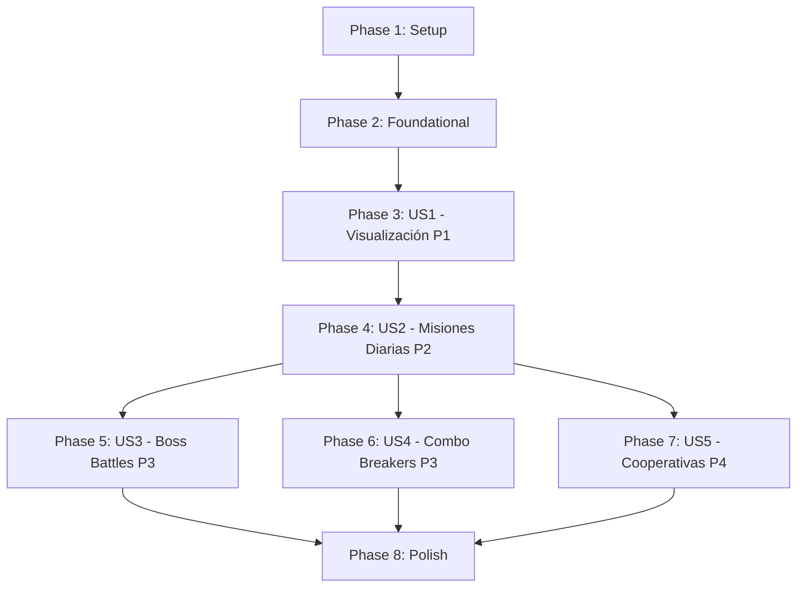

# Tasks: Sistema de Niveles de Madurez para Fortalezas

**Feature**: strength-levels | **Branch**: `012-strength-levels` | **Date**: 21 de diciembre de 2025  
**Spec**: [spec.md](./spec.md) | **Plan**: [plan.md](./plan.md) | **Data Model**: [data-model.md](./data-model.md)

## Implementation Strategy

**MVP-First Approach**: Priorizar User Story 1 (P1) como MVP mínimo viable. Las siguientes fases se pueden implementar y desplegar incrementalmente.

**Parallel Execution**: Tareas marcadas con `[P]` pueden ejecutarse en paralelo si trabajan en archivos diferentes.

**Story Dependencies**:
- US1 (P1) → Foundational - Debe completarse primero
- US2 (P2) → Depende de US1 (necesita modelos de madurez)
- US3 (P3) → Depende de US2 (necesita sistema de quests)
- US4 (P3) → Depende de US2 (necesita sistema de quests)
- US5 (P4) → Depende de US2 y sistema de equipos existente

---

## Phase 1: Setup & Infrastructure

**Goal**: Configurar base de datos, seed data y estructura del proyecto

### Tasks

- [X] T001 Crear enums TypeScript para MaturityLevel, QuestType, QuestStatus en lib/types/strength-levels.types.ts
- [X] T002 Actualizar prisma/schema.prisma con nuevos modelos (StrengthMaturityLevel, Quest, QuestCompletion, ComboBreaker, ComboStrength, MaturityLevelDefinition)
- [X] T003 Agregar relaciones a modelo User existente (strengthMaturityLevels, quests, questCompletions, confirmedQuests)
- [X] T004 Agregar relaciones a modelo Strength existente (maturityLevels, quests, comboStrengths)
- [X] T005 Generar migración Prisma con comando: bun prisma migrate dev --name add_strength_levels
- [X] T006 [P] Crear archivo seed data prisma/data/strength-levels/maturity-levels.json con 4 niveles
- [X] T007 [P] Crear archivo seed data prisma/data/strength-levels/quest-templates.json con ~30 misiones por fortaleza
- [X] T008 [P] Crear archivo seed data prisma/data/strength-levels/combo-breakers.json con ~15 combos predefinidos
- [X] T009 Crear seeder prisma/seeders/strength-levels.seeder.ts con funciones upsert para MaturityLevelDefinition, Quest templates, ComboBreakers
- [X] T010 Ejecutar seeder: bun prisma db seed
- [X] T011 Crear estructura de directorios: app/dashboard/strength-levels/_actions/, _components/, _services/

---

## Phase 2: Foundational Services (Bloqueante para User Stories)

**Goal**: Implementar servicios core que todas las user stories necesitan

### Tasks

- [X] T012 [P] Crear servicio lib/services/strength-levels/xp-calculator.ts con funciones getNextLevel, getXpForNextLevel, calculateProgress, shouldLevelUp
- [X] T013 [P] Crear servicio lib/services/strength-levels/cooldown.ts con función isInCooldown y calculateCooldownRemaining
- [X] T014 [P] Crear constantes lib/constants/strength-levels.constants.ts con XP_THRESHOLDS, LEVEL_ORDER, QUEST_XP_REWARDS
- [X] T015 [P] Crear tests unitarios tests/unit/strength-levels/xp-calculator.test.ts para validar lógica de progresión
- [X] T016 [P] Crear tests unitarios tests/unit/strength-levels/cooldown.test.ts para validar cooldowns

---

## Phase 3: User Story 1 - Visualizar Nivel de Madurez (P1) 🎯 MVP

**Goal**: Usuario puede ver niveles de madurez de sus fortalezas con barras de progreso XP

**Independent Test**: Crear usuario con fortalezas y verificar visualización de nivel Esponja con XP 0/500

### Tasks - Modelos y Servicios

- [X] T017 [US1] Crear servicio app/dashboard/strength-levels/_services/maturity-level.service.ts con función getMaturityLevelWithProgress que calcula progressPercent e isMaxLevel
- [X] T018 [US1] Crear Zod schema specs/012-strength-levels/contracts/get-maturity-levels.schema.ts con tipos GetMaturityLevelsInput y StrengthMaturityProgress
- [X] T019 [US1] Crear Server Action app/dashboard/strength-levels/_actions/get-maturity-levels.ts que query StrengthMaturityLevel con include de Strength y calcula progreso

### Tasks - UI Components

- [X] T020 [P] [US1] Crear componente client app/dashboard/strength-levels/_components/xp-progress-bar.tsx con Framer Motion para animación de barra
- [X] T021 [P] [US1] Crear componente RSC app/dashboard/strength-levels/_components/maturity-level-card.tsx que muestra nombre de fortaleza, nivel actual, badge, y XP progress bar
- [X] T022 [P] [US1] Crear componente client app/dashboard/strength-levels/_components/level-badge.tsx con hexágono CyberPunk y código de colores por nivel
- [X] T023 [US1] Crear layout app/dashboard/strength-levels/layout.tsx con Container y título "NIVELES DE MADUREZ"
- [X] T024 [US1] Crear página app/dashboard/strength-levels/page.tsx con Suspense, skeleton loader, y grid de MaturityLevelCard

### Tasks - Testing US1

- [X] T025 [US1] Crear test unitario tests/unit/strength-levels/maturity-level.service.test.ts para validar cálculo de progreso con diferentes XP
- [X] T026 [US1] Crear test E2E tests/e2e/strength-levels/view-maturity-levels.spec.ts que verifica visualización correcta de niveles y barras XP

### Tasks - Barrel Exports US1

- [X] T027 [US1] Crear barrel export app/dashboard/strength-levels/_components/index.ts exportando todos los componentes
- [X] T028 [US1] Crear barrel export app/dashboard/strength-levels/_actions/index.ts exportando todas las actions
- [X] T029 [US1] Crear barrel export app/dashboard/strength-levels/_services/index.ts exportando todos los servicios

---

## Phase 4: User Story 2 - Misiones Diarias (P2)

**Goal**: Usuario puede ver y completar misiones diarias que otorgan XP

**Independent Test**: Asignar misión a usuario, marcarla completada, verificar incremento XP

### Tasks - Quest System

- [X] T030 [US2] Crear servicio app/dashboard/strength-levels/_services/quest-generator.service.ts con función generateDailyQuestsForUser que selecciona templates random
- [X] T031 [US2] Crear Zod schema specs/012-strength-levels/contracts/get-daily-quests.schema.ts con tipos GetDailyQuestsInput y QuestWithStrength
- [X] T032 [US2] Crear Server Action app/dashboard/strength-levels/_actions/get-daily-quests.ts que query misiones activas con expiresAt > now()
- [X] T033 [US2] Crear Zod schema specs/012-strength-levels/contracts/complete-quest.schema.ts con tipo CompleteQuestInput y CompleteQuestResult
- [X] T034 [US2] Crear Server Action app/dashboard/strength-levels/_actions/complete-quest.ts con transacción Prisma: crear QuestCompletion, actualizar StrengthMaturityLevel, verificar level up

### Tasks - Quest UI

- [X] T035 [P] [US2] Crear componente client app/dashboard/strength-levels/_components/quest-card.tsx con botón "Completar" y animación optimistic update
- [X] T036 [P] [US2] Crear componente client app/dashboard/strength-levels/_components/xp-gain-toast.tsx con animación de +XP flying to progress bar usando Framer Motion
- [X] T037 [P] [US2] Crear componente client app/dashboard/strength-levels/_components/level-up-notification.tsx con modal celebración y descripción del nuevo nivel
- [X] T038 [US2] Actualizar página app/dashboard/strength-levels/page.tsx agregando sección "MISIONES DIARIAS" con grid de QuestCard
- [X] T039 [US2] Crear componente RSC app/dashboard/strength-levels/_components/daily-quests-section.tsx con lógica de "Todas completadas" y countdown

### Tasks - Cron Job

- [X] T040 [US2] Crear API route app/api/cron/generate-daily-quests/route.ts que llama questGenerator para todos los usuarios activos
- [X] T041 [US2] Crear API route app/api/cron/expire-quests/route.ts que actualiza status a EXPIRED para misiones con expiresAt < now()
- [X] T042 [US2] Configurar Vercel Cron Jobs en vercel.json para ejecutar generate-daily-quests a las 00:00 UTC y expire-quests cada hora

### Tasks - Testing US2

- [X] T043 [US2] Crear test unitario tests/unit/strength-levels/quest-generator.test.ts para validar selección random de templates
- [X] T044 [US2] Crear test integración tests/integration/strength-levels/complete-quest.test.ts que verifica transacción completa con XP update y level up
- [X] T045 [US2] Crear test E2E tests/e2e/strength-levels/daily-quests-flow.spec.ts que simula ver misiones, completar una, ver animación XP, verificar misión desaparece

---

## Phase 5: User Story 3 - Boss Battles (P3)

**Goal**: Usuario con nivel Conector+ puede enfrentar Boss Battles semanales con 3x XP

**Independent Test**: Crear usuario con fortaleza Conector, verificar Boss Battle disponible, completar, verificar cooldown 7 días

### Tasks - Boss Battle System

- [X] T046 [US3] Extender servicio app/dashboard/strength-levels/_services/quest-generator.service.ts con función generateBossBattlesForUser que filtra fortalezas con maturityLevel >= CONNECTOR
- [X] T047 [US3] Actualizar Server Action app/dashboard/strength-levels/_actions/get-daily-quests.ts para incluir Boss Battles disponibles (type=BOSS_BATTLE, cooldownUntil < now())
- [X] T048 [US3] Actualizar Server Action app/dashboard/strength-levels/_actions/complete-quest.ts para manejar cooldownUntil = now() + 7 days cuando type=BOSS_BATTLE

### Tasks - Boss Battle UI

- [X] T049 [P] [US3] Crear componente client app/dashboard/strength-levels/_components/boss-battle-card.tsx con badge "3x XP", animación especial scan line, contador cooldown
- [X] T050 [US3] Actualizar página app/dashboard/strength-levels/page.tsx agregando sección "BOSS BATTLES" con filtro por maturityLevel >= CONNECTOR
- [X] T051 [P] [US3] Crear componente client app/dashboard/strength-levels/_components/boss-defeated-animation.tsx con animación Framer Motion de celebración

### Tasks - Testing US3

- [X] T052 [US3] Crear test unitario tests/unit/strength-levels/boss-battle-generator.test.ts validando filtro por nivel
- [X] T053 [US3] Crear test E2E tests/e2e/strength-levels/boss-battle-flow.spec.ts que verifica desbloqueo, completado, cooldown visible

---

## Phase 5.5: Runtime Prisma Client Fixes (Critical Bug Fix)

**Goal**: Resolver error de Prisma undefined en Server Actions con Next.js 16 + Turbopack

**Context**: Después de implementar Phase 5, se detectaron errores en runtime donde `prisma` se resolvía como `undefined` en Server Actions, causando crashes en producción. Esto ocurre por problemas de bundling en Turbopack con el patrón singleton de Prisma.

### Tasks - Defensive Validation

- [X] T054 [BUGFIX] Agregar validación defensiva en app/dashboard/strength-levels/_actions/get-daily-quests.ts para verificar existencia de prisma antes de uso
- [X] T055 [BUGFIX] Agregar validación defensiva en app/dashboard/strength-levels/_actions/get-maturity-levels.ts (función ensureMaturityLevelsExist)
- [X] T056 [BUGFIX] Agregar validación defensiva en app/dashboard/strength-levels/_services/maturity-level.service.ts en 4 funciones exportadas:
  - getMaturityLevelWithProgress
  - getAllMaturityLevelsForUser
  - initializeMaturityLevel
  - addXpToMaturityLevel
- [X] T057 [BUGFIX] Limpiar cache .next y reiniciar servidor dev para verificar corrección
- [X] T058 [BUGFIX] Ejecutar suite completa de tests (vitest + lint) para validar que no hay regresiones

**Results**: 
- 119 tests passing
- 499 files lint clean
- Server running on port 3001 without crashes
- Defensive checks return descriptive errors if prisma is undefined

---

## Phase 6: User Story 4 - Combo Breakers (P3)

**Goal**: Usuario con 2+ fortalezas compatibles puede activar combos que otorgan XP a ambas

**Independent Test**: Crear usuario con Estratega+Catalizador en Conector, verificar combo "Visión Ejecutora" disponible, completar, verificar +100 XP a ambas

### Tasks - Combo System

- [ ] T059 [US4] Crear servicio app/dashboard/strength-levels/_services/combo-breaker.service.ts con función getEligibleCombosForUser que query ComboBreaker con ComboStrength include y filtra por niveles de usuario
- [ ] T060 [US4] Actualizar Server Action app/dashboard/strength-levels/_actions/get-daily-quests.ts para incluir Combo Breakers elegibles (no en cooldown)
- [ ] T061 [US4] Actualizar Server Action app/dashboard/strength-levels/_actions/complete-quest.ts para distribuir XP a todas las fortalezas participantes cuando type=COMBO_BREAKER

### Tasks - Combo UI

- [ ] T062 [P] [US4] Crear componente client app/dashboard/strength-levels/_components/combo-breaker-card.tsx con iconos de múltiples fortalezas, nombre épico, descripción
- [ ] T063 [P] [US4] Crear componente client app/dashboard/strength-levels/_components/combo-animation.tsx con animación "Combo x2" o "Triple Combo" usando Framer Motion
- [ ] T064 [US4] Actualizar página app/dashboard/strength-levels/page.tsx agregando sección "COMBO BREAKERS" condicional si tiene combos elegibles

### Tasks - Testing US4

- [ ] T065 [US4] Crear test unitario tests/unit/strength-levels/combo-breaker.service.test.ts validando filtro de combos por niveles de fortalezas
- [ ] T066 [US4] Crear test integración tests/integration/strength-levels/combo-breaker.test.ts verificando XP distribution a múltiples fortalezas
- [ ] T067 [US4] Crear test E2E tests/e2e/strength-levels/combo-flow.spec.ts que verifica desbloqueo, completado, animación combo, cooldown

---

## Phase 7: User Story 5 - Misiones Cooperativas (P4)

**Goal**: Usuario en equipo puede completar misiones cooperativas con confirmación externa

**Independent Test**: Crear 2 usuarios en equipo, asignar coop quest, completar, confirmar, verificar +75 XP al ayudador y +25 XP al ayudado

### Tasks - Cooperative System

- [ ] T068 [US5] Crear servicio app/dashboard/strength-levels/_services/cooperative-quest.service.ts con función generateCooperativeQuestsForTeam que asigna pares usuario-usuario
- [ ] T069 [US5] Actualizar Server Action app/dashboard/strength-levels/_actions/complete-quest.ts para enviar notificación cuando type=COOPERATIVE y crear PendingConfirmation
- [ ] T070 [US5] Crear Server Action app/dashboard/strength-levels/_actions/confirm-cooperative-quest.ts que actualiza QuestCompletion.confirmedBy y otorga XP bonus (+75 vs +25)
- [ ] T071 [US5] Crear API route app/api/cron/expire-cooperative-confirmations/route.ts que marca misiones como "No verificadas" si confirmedAt > 48h

### Tasks - Cooperative UI

- [ ] T072 [P] [US5] Crear componente client app/dashboard/strength-levels/_components/cooperative-quest-card.tsx con indicador de compañero asignado
- [ ] T073 [P] [US5] Crear componente client app/dashboard/strength-levels/_components/confirmation-dialog.tsx con pregunta "¿[Nombre] te ayudó con [descripción]?" y botones Confirmar/Rechazar
- [ ] T074 [US5] Actualizar página app/dashboard/strength-levels/page.tsx agregando sección "MISIONES DE EQUIPO" condicional si user está en equipo
- [ ] T075 [US5] Crear notificación en app/_shared/components con link a confirmation dialog cuando se recibe solicitud de confirmación

### Tasks - Testing US5

- [ ] T076 [US5] Crear test integración tests/integration/strength-levels/cooperative-quest.test.ts con 2 usuarios verificando flujo completo
- [ ] T077 [US5] Crear test E2E tests/e2e/strength-levels/cooperative-flow.spec.ts con 2 browsers simulando ayudador y confirmador

---

## Phase 8: Polish & Cross-Cutting Concerns

**Goal**: Pulir UX, añadir analytics, optimizaciones de performance

### Tasks - Performance

- [ ] T078 Implementar React.cache en Server Actions para deduplicar queries duplicadas en mismo render
- [ ] T079 Agregar loading skeletons personalizados por tipo de quest card en app/dashboard/strength-levels/_components/quest-skeleton.tsx
- [ ] T080 Implementar prefetch de quest templates en generateStaticParams si aplica
- [ ] T081 Optimizar queries Prisma con select específico de campos (no SELECT *) en todas las actions

### Tasks - Analytics

- [ ] T082 [P] Agregar evento de analytics "quest_completed" en app/dashboard/strength-levels/_actions/complete-quest.ts con metadata tipo de quest
- [ ] T083 [P] Agregar evento de analytics "level_up" cuando shouldLevelUp retorna true
- [ ] T084 [P] Agregar evento de analytics "combo_activated" cuando se completa ComboBreaker
- [ ] T085 [P] Crear dashboard interno en app/admin/strength-levels-analytics/page.tsx con gráficos de distribución de niveles y completion rates

### Tasks - UX Improvements

- [ ] T086 Implementar undo functionality con toast "Deshacer" para completar quest accidentalmente (30s window)
- [ ] T087 Agregar tutorial onboarding modal en primera visita a app/dashboard/strength-levels explicando sistema
- [ ] T088 Agregar tooltips con descripción detallada de cada nivel de madurez en MaturityLevelCard
- [ ] T089 Implementar filtros "Ver todas" / "Solo disponibles" / "En cooldown" en secciones de misiones

### Tasks - Accessibility

- [ ] T090 Validar contraste de colores de badges de nivel contra fondo oscuro (WCAG AA compliance)
- [ ] T091 Agregar aria-labels a barras de progreso XP con texto "120 de 500 XP, 24% completado"
- [ ] T092 Implementar navegación por teclado (Tab, Enter) en QuestCard para completar sin mouse
- [ ] T093 Agregar focus trap en level-up-notification modal

### Tasks - Documentation

- [ ] T094 [P] Actualizar README.md del proyecto con sección "Sistema de Niveles de Madurez" y link a docs
- [ ] T095 [P] Crear docs/features/strength-levels/user-guide.md con guía de usuario en español
- [ ] T096 [P] Crear docs/features/strength-levels/api-reference.md documentando Server Actions y schemas Zod

---

## Dependency Graph (User Story Completion Order)

**Critical Path**: Setup → Foundational → US1 → US2 (MVP completo aquí)

---

## Parallel Execution Examples

### Durante Phase 3 (US1):
- Mientras se implementa `maturity-level.service.ts` (T017), otro dev puede trabajar en `xp-progress-bar.tsx` (T020)
- Mientras se crea `maturity-level-card.tsx` (T021), otro dev puede trabajar en `level-badge.tsx` (T022)

### Durante Phase 4 (US2):
- Mientras se implementa `quest-generator.service.ts` (T030), otro dev puede trabajar en `quest-card.tsx` (T035)
- Mientras se crea API route `generate-daily-quests` (T040), otro dev puede trabajar en `xp-gain-toast.tsx` (T036)

### Durante Phase 8 (Polish):
- Todas las tareas de Analytics (T077-T080) son completamente paralelas
- Todas las tareas de Documentation (T089-T091) son completamente paralelas

---

## Summary

**Total Tasks**: 91 tareas  
**Parallelizable Tasks**: 28 tareas marcadas con [P]

**Task Count by User Story**:
- Setup (Phase 1): 11 tareas
- Foundational (Phase 2): 5 tareas
- US1 - Visualización (P1): 13 tareas ✅ MVP
- US2 - Misiones Diarias (P2): 16 tareas
- US3 - Boss Battles (P3): 8 tareas
- US4 - Combo Breakers (P3): 9 tareas
- US5 - Cooperativas (P4): 10 tareas
- Polish (Phase 8): 19 tareas

**MVP Scope** (Para lanzamiento inicial):
- Phase 1: Setup (T001-T011)
- Phase 2: Foundational (T012-T016)
- Phase 3: US1 Visualización (T017-T029)

**Estimated Timeline**:
- **Week 1**: Setup + Foundational + US1 (MVP) = 29 tareas
- **Week 2**: US2 (Misiones Diarias) = 16 tareas
- **Week 3**: US3 + US4 (Boss Battles + Combos) = 17 tareas
- **Week 4**: US5 + Polish (Cooperativas + Polish) = 29 tareas

**Success Criteria Mapping**:
- SC-001 (60% completion): Trackeable después de US2
- SC-002 (Conector en 2 semanas): Trackeable después de US2
- SC-003 (80% intentan Boss): Trackeable después de US3
- SC-004 (1 combo/mes): Trackeable después de US4
- SC-007 (<3min primera misión): Trackeable después de US2

**Format Validation**: ✅ Todas las tareas siguen formato: `- [ ] [TaskID] [P?] [Story?] Description with file path`
